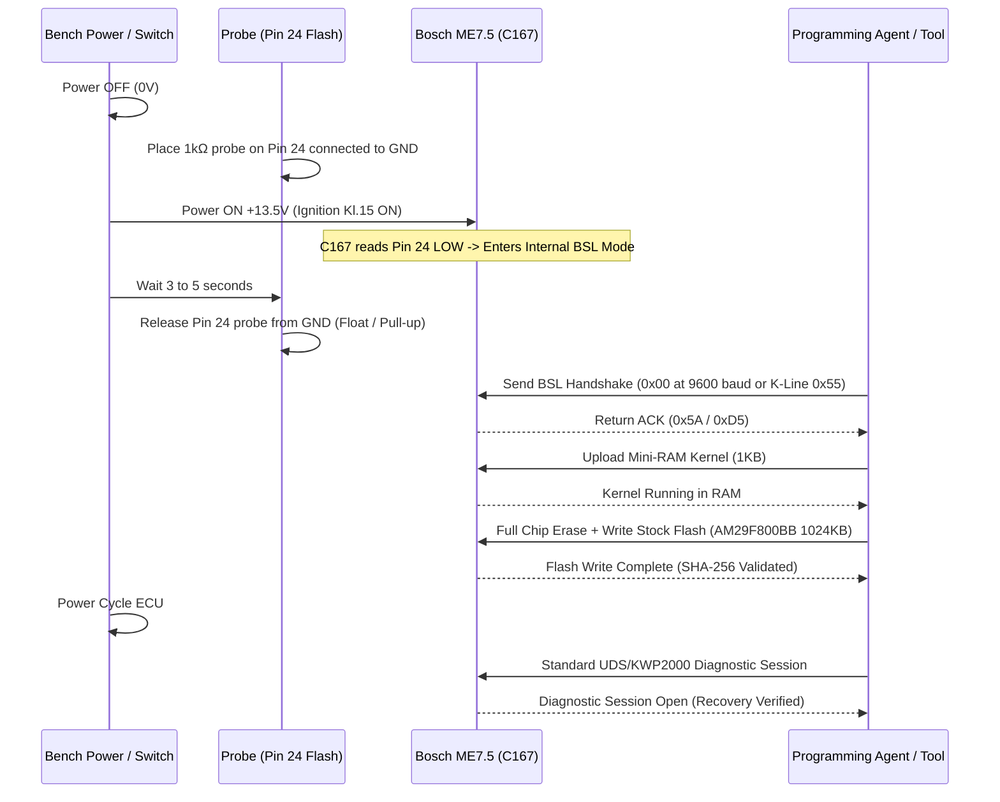

# BOSCH ME7.5 PHYSICAL BENCH RECOVERY RUNBOOK
## Emergency Boot-Mode Unbricking & Firmware Restoration Protocol

```
Document ID: RUNBOOK-ECU-REC-001
Target Platform: Bosch ME7.5 (Audi / Volkswagen 1.8T / 2.7T / 2.8L)
Microcontroller: Infineon C167CR / C167CS
Flash Memory: AMD AM29F800BB / AM29F400BT (800KB / 1024KB TSOP48)
Safety Classification: HARDWARE BENCH EMERGENCY ONLY (STRICTLY PROHIBITED IN-VEHICLE)
```

---

## 1. Safety Warnings & Prerequisite Directives

> [!CAUTION]
> **DO NOT ATTEMPT IN-VEHICLE**
> Bench recovery requires direct physical access to the PCB and grounding pin 24 of the flash memory IC. Attempting this inside a vehicle can short the wiring harness, damage the instrument cluster, or trigger passive immobilizer lockout.

1. **Power Supply Requirement**:
   - Bench Power Supply with regulated **13.5V to 13.8V DC** (Never exceed 14.2V).
   - Current limit set to **2.0A maximum** (Normal idle draw is 0.35A - 0.45A; current draw > 0.8A indicates short circuit).
2. **ESD Protection**:
   - Grounded anti-static wrist strap mandatory.
   - Grounded ESD mat under ECU PCB.
3. **Resistor Probe**:
   - Always ground pin 24 through a **1 kΩ to 5 kΩ resistor** (never direct dead-ground to avoid burning internal pull-ups if pin configuration is misidentified).

---

## 2. Pinout & Bench Harness Wiring

### Bosch ME7.5 Connector Layout
The ME7.5 uses two main harness connectors: **Large 81-pin connector** and **Small 40-pin connector**.

```
+-------------------------------------------------------------+
|               Bosch ME7.5 Bench Harness Wiring              |
+-------------------------------------------------------------+
| Connector Pin | Function               | Wire Color (Std)   |
|---------------+------------------------+--------------------|
| Pin 1         | Battery Ground (GND)   | Black              |
| Pin 2         | Battery Ground (GND)   | Black              |
| Pin 3         | Permanent +12V (Kl. 30)| Red                |
| Pin 4         | Ignition Switch (Kl.15)| Yellow (Switched)  |
| Pin 21        | K-Line (ISO 9141-2)    | Blue / White       |
| Pin 43        | K-Line (Alt diagnostics| Blue / Green       |
| Pin 58        | CAN-High (500 kbps)    | Orange / Black     |
| Pin 62        | CAN-Low (500 kbps)     | Orange / Brown     |
+-------------------------------------------------------------+
```

---

## 3. Flash Memory Identification (AMD 29F800BB / TSOP48)

Open the aluminum ECU housing by removing the 4 Torx T15 perimeter screws and gently prying the silicone sealant with a plastic spudger.

Locate the 48-pin surface-mount flash chip marked **AM29F800BB** (or ST M29F800FB):

```
                        AM29F800BB TSOP-48
                     +----------------------+
          (Pin 1) -> | o                  48|
                     | 2                  47|
                     | ...               ...|
                     | 23                 25|
                     | 24 [BOOT PIN]      25|
                     +----------------------+
```

- **Pin 24 is `/RESET` or dedicated Boot-Mode select line** on Infineon C167 architecture.
- Grounding Pin 24 during CPU power-on forces the internal bootstrap loader (BSL) in the C167 microcontroller to execute from internal ROM instead of corrupt flash memory.

---

## 4. Step-by-Step Recovery Sequence



### Detailed Execution:
1. **Prepare Tooling**:
   - Ensure the original immutable stock binary (`STOCK_ORIGINAL.bin` with matching software version e.g. `06A906032HN_0002`) is staged in the Firmware Vault with double-read SHA-256 verification.
2. **Place Boot Pin**:
   - With power **OFF**, place the 1 kΩ grounded probe firmly against **Pin 24** of the AM29F800BB chip.
3. **Power Up**:
   - Switch bench power supply ON (Kl.30 and Kl.15 active).
   - Observe bench supply current: should read ~0.20A - 0.25A (lower than normal operating current because the main application is halted).
4. **Release Boot Pin**:
   - Keep grounded for **3 to 5 seconds** after power is applied, then remove the probe.
   - Do **NOT** ground Pin 24 while flashing is in progress.
5. **Establish Bootstrap Communication**:
   - Issue KWP/BSL connect via K-Line at 9600/10400 baud.
   - The C167 bootstrap loader will respond with single ACK byte (`0xD5` or `0x5A`).
6. **Deploy RAM Loader**:
   - Transmit the signed ME7 RAM flashing kernel. The kernel relocates to internal CPU RAM (`0xFA00 - 0xFDFF`).
7. **Write Firmware Binary**:
   - Execute full block erase of blocks 0x000000 - 0x0FFFFF.
   - Stream firmware blocks (256 bytes/packet) with ISO-TP flow control.
8. **Verify Checksum**:
   - Compare block-by-block complement sums using `BoschMe7ChecksumStrategy`.
9. **Exit Boot Mode**:
   - Turn bench power supply OFF.
   - Wait 10 seconds for capacitors to discharge.
   - Turn bench power ON without grounding Pin 24.
   - Send UDS `$10 $01` (Diagnostic Default Session) on K-Line/CAN. A positive response `$50 $01` confirms ECU is fully recovered and operational.

---

## 5. Verification Checklist Post-Recovery

- [ ] ECU responds to ReadDataByIdentifier ($22 $F1 $90) with original VIN.
- [ ] ECU responds to ReadDataByIdentifier ($22 $F1 $87) with OEM Part Number.
- [ ] No internal ROM/RAM checksum error DTCs (P0601 / P0606) stored in fault memory.
- [ ] Current draw at idle (13.5V) stabilized within 0.35A - 0.45A range.
- [ ] Immutable recovery log recorded in `FirmwareVault` with operator signature and timestamp.
