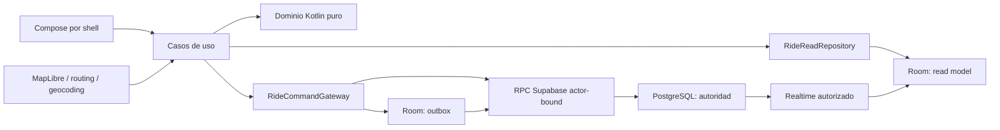
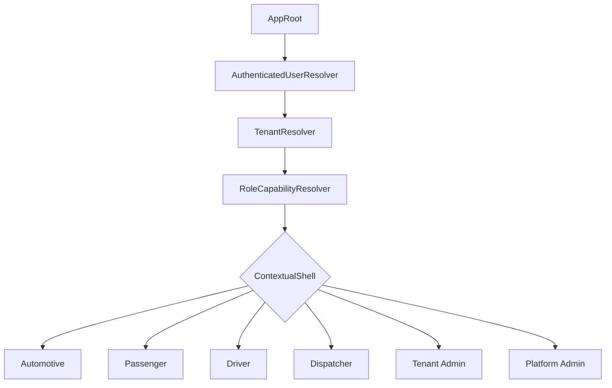

# Arquitectura de Elysium Vanguard Viajes

## Autoridad y dependencias

PostgreSQL es la autoridad de viajes, asignaciones, precios, comisión, wallet,
PIN, roles y eventos. Room no decide un resultado comercial: conserva comandos
pendientes, proyecciones y estado de interfaz.

## Fronteras dentro de una APK

La extracción comienza con paquetes e interfaces para reducir el riesgo del
proyecto Android actual. La modularización Gradle ocurre después de romper la
dependencia entre UI, `ObdViewModel`, Room y Supabase.

- `ride/domain`: dinero, estados, reglas y errores; Kotlin puro.
- `ride/application`: casos de uso y puertos.
- `ride/data/local`: Room, read models y outbox.
- `ride/data/remote`: DTOs, RPC, realtime y autenticación.
- `ride/passenger`: flujos de pasajero.
- `ride/driver`: flujos de conductor.
- `ride/dispatch`: despacho y consola.
- `ride/safety`: consentimiento, guardian y evidencia.
- `ride/payments`: estrategias de liquidación; sin Google Play Billing para
  transportar personas.

## Shell contextual

El selector visual solicita contexto; nunca concede permisos. Las capacidades
provienen de claims/memberships verificadas por backend. Un shell de Viajes no
inicia OBD, bases 3D ni trabajos automotrices innecesarios.

## Reglas de integración

1. La UI nunca escribe estados finales directamente.
2. Cada command lleva una idempotency key estable.
3. El servidor deriva el actor de `auth.uid()`.
4. Las respuestas incluyen versión y event/correlation ID.
5. Realtime acelera la proyección; catch-up autoritativo repara eventos perdidos.
6. El mapa distingue una ruta vial confirmada de puntos sin ruta.
7. Los proveedores externos se encapsulan detrás de interfaces y errores tipados.
