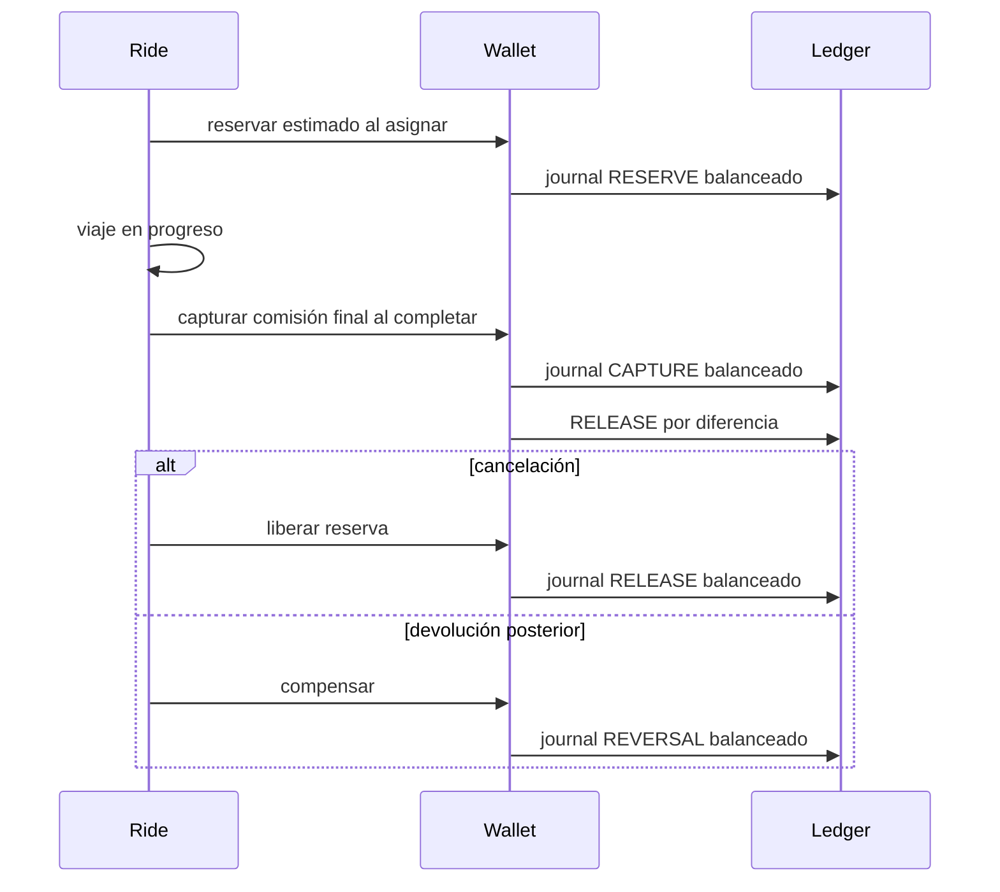

# Política canónica de comisión del 5%

## Identidad

- Política pública: exactamente 500 basis points.
- Escala: 10.000 basis points = 100%.
- Versión inicial: `ride-commission-v1`.
- Redondeo: half-up a unidades menores enteras.
- La moneda forma parte del valor y no puede mezclarse implícitamente.

## Base comisionable

Incluye únicamente importes devengados por el conductor:

- tarifa de transporte;
- espera aprobada;
- paradas aprobadas;
- recargos aprobados;
- cargo de cancelación efectivamente cobrado;
- descuentos financiados por el conductor.

Las devoluciones de componentes comisionables reducen la base hasta un mínimo
de cero.

Excluye:

- propinas;
- peajes;
- impuestos;
- promociones financiadas por plataforma;
- cargos del procesador;
- depósitos, wallet top-ups o transferencias;
- compensaciones no vinculadas al servicio comisionable.

## Fórmula

```text
commissionable_base_minor =
  transport_fare_minor
  + approved_wait_minor
  + approved_stops_minor
  + approved_surcharges_minor
  + collected_cancellation_fee_minor
  - driver_funded_discount_minor
  - refunded_commissionable_minor

platform_commission_minor =
  round_half_up(commissionable_base_minor * 500 / 10000)
```

El cálculo separa cociente y residuo para evitar overflow de `Long`.

## Ciclo financiero



La falta temporal de saldo o del procesador no bloquea una emergencia ni la
finalización física. Se registra deuda/estado pendiente según la estrategia del
tenant, sin falsear una liquidación.

## Reparto interno

Los splits se versionan y su suma debe ser exactamente 500 bps para una
política activa. Nunca incrementan la comisión pública. Un cambio de reparto no
reescribe journals históricos.
