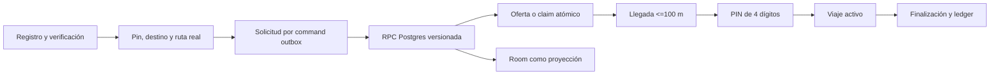

# MEET Viajes V5 — Architecture Audit

Fecha: 2026-08-08  
Base auditada: `v4.11.0` / `origin/main` (`a78638bf`)  
Alcance: Android, Room, command outbox, Supabase/Postgres, mapas, seguridad y UX.

## Veredicto

Viajes no es un mockup. Ya tiene un walking skeleton serio: registro de pasajero y conductor, ubicación y pin, geocodificación/ruta con resiliencia, paradas ordenadas, solicitud, oferta/claim, asignación única, llegada con GPS, PIN, inicio, cancelación, finalización, ledger, Guardian, soporte, chat multimedia, proyección Room y sincronización remota. PostgreSQL es autoridad para las transiciones críticas y Room es proyección/offline.

No obstante, V4.11 todavía no cumple por completo la orden V5. Las mayores brechas son ratings autoritativos y ciegos, Live Share web tokenizado, contactos confiables, Evidence Vault, Trip Digital Twin, foreground trip service y separación del monolito `ObdViewModel`/`RideServiceScreen`.

## Flujo actualmente conectado

## Autoridad y persistencia

| Área | Estado real | Autoridad |
|---|---|---|
| Lifecycle y asignación | Conectado, versionado e idempotente | PostgreSQL RPC |
| Comisión y ledger | Doble entrada y 5% | PostgreSQL |
| Tarifas V5 | `OPEN_BID` y `METERED_TIME_DISTANCE`; snapshot de tasas | PostgreSQL V3 |
| Paradas iniciales | Ordenadas y transaccionales | PostgreSQL |
| Paradas activas | Solo tarifa medida, actor/version gate y evento | PostgreSQL V3 |
| Posiciones y reportes viales | Parcialmente conectados, TTL/políticas existentes | Mixta |
| Chat | Texto/audio/imagen local y gateway preparado | Mixta; proveedor realtime pendiente de operación |
| Rating | Escritura local heredada | **No apto como autoridad** |
| Live Share | Compartición estática local | **No existe sesión web autoritativa** |
| Evidence Vault | No existe | Pendiente |

## Riesgos confirmados

1. `ObdViewModel` concentra movilidad, multimedia, OBD y otras responsabilidades; debe extraerse gradualmente, sin big bang.
2. `RideServiceScreen` contiene booking, driver dashboard y viaje activo; separar por experiencia reducirá recomposición y riesgo.
3. Los campos `Double` de precio sobreviven como compatibilidad visual. La autoridad ya usa minor units; no deben alimentar ledger.
4. `submitRideRating()` aún no usa RPC autoritativo ni blind ratings.
5. Guardian minimiza detalle en el event log, pero no hay vault cifrado separado para evidencia sensible.
6. Live Share actual no entrega tracking web revocable mediante token hash.
7. Endpoints comunitarios de mapas son base técnica, no SLA comercial global.
8. No hay prueba física de dos dispositivos en esta auditoría.

## Decisión V5 aplicada en este corte

- `OPEN_BID`: oferta libre, paradas cerradas después de publicar.
- `METERED_TIME_DISTANCE`: CRC, ₡300/km + ₡60/min, prorrateo por metro/segundo, tasas versionadas y paradas activas permitidas.
- El cliente solo calcula un estimado explicable. PostgreSQL repite el cálculo, rechaza discrepancias y registra el cambio de ruta.
- No se inventa tarifa final: requiere medición autoritativa de distancia/tiempo reales antes de liquidar.

## Clasificación de la orden V5

| Grupo | Estado |
|---|---|
| Booking, pin, ruta, paradas, pagos declarados | Base existente; tarifa dual V5 añadida |
| Matching, atomicidad, outbox, RLS, ledger | Base seria existente |
| Guardian, reportes viales, soporte | Parcial conectado; falta case management 2.0 |
| Ratings V2, reputación bayesiana | Pendiente de autoridad remota |
| History Digital Twin e integridad encadenada | Pendiente |
| Live Share y contactos confiables | Pendiente |
| Evidence Vault/audio legal | Pendiente de diseño jurídico/proveedor |
| Foreground location, spoof/fusion/collision | Pendiente de hardening Android |
| PostGIS, escala regional, consola operativa | Pendiente de infraestructura |

## Regla de evolución

Cada fase debe entregar dominio, persistencia, autorización, offline/error, UI, observabilidad, tests y documentación. Una pantalla sin backend no se marcará como implementada.
