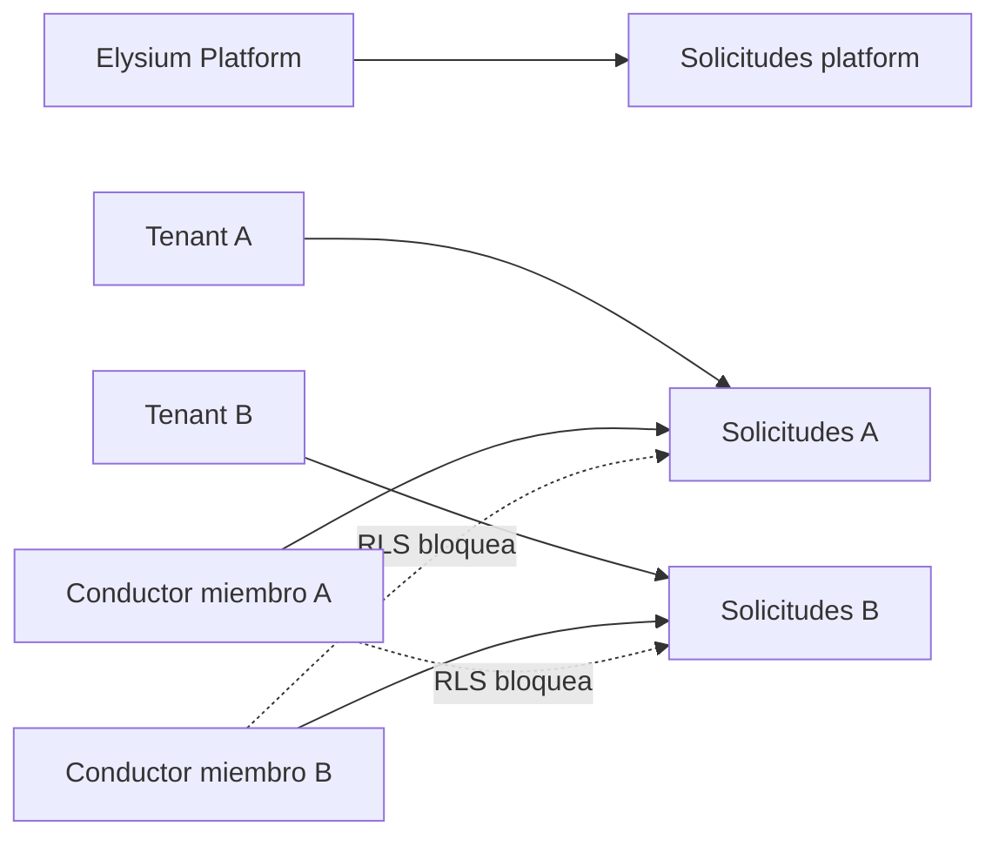

# Multitenancy de Viajes

Fecha: 2026-07-29

## Frontera actual

El mercado existente se representa explícitamente como el tenant
`Elysium Vanguard Platform`. Cooperativas, centrales, flotas, hoteles,
empresas e instituciones se provisionan exclusivamente desde backend.

## Agregados con `tenant_id`

- viajes;
- vehículos de conductor;
- ofertas;
- receipts de comandos;
- cotizaciones y reservas;
- transacciones y cálculos de comisión;
- holds operacionales;
- eventos Guardian;
- casos de soporte.

Los triggers heredan el tenant desde el viaje para evitar que un cliente
manipule el valor. Otro trigger exige igualdad entre tenant de viaje, oferta y
vehículo.

## RLS y autoridad

- Un participante conserva acceso a su propio historial.
- Un conductor solo ve búsquedas de su tenant cuando tiene membresía activa y
  vehículo elegible en ese mismo tenant.
- Un despachador o administrador solo ve el tenant de su membresía.
- Android no crea tenants, no activa membresías y ya no escribe directamente
  viajes, vehículos u ofertas.
- El tenant platform mantiene el flujo público actual.

## Estado honesto

La frontera de aislamiento y el esquema están activos. La consola de
aprovisionamiento, branding remoto, zonas, contratos, federación y overflow no
se presentan como terminados. Un tenant privado debe permanecer en
`CONFIGURING` hasta que backend, operaciones y pruebas de jurisdicción lo
habiliten.

## Evidencia

`tests/ride/ride-tenant-boundary-integration.sql` verifica:

- conductor A ve solicitudes A;
- conductor A no ve solicitudes B;
- el conductor no puede mover su vehículo entre tenants;
- una oferta cruzada falla con `RIDE_TENANT_MISMATCH`;
- la suite financiera y los 100 reclamos del tenant platform siguen verdes.
