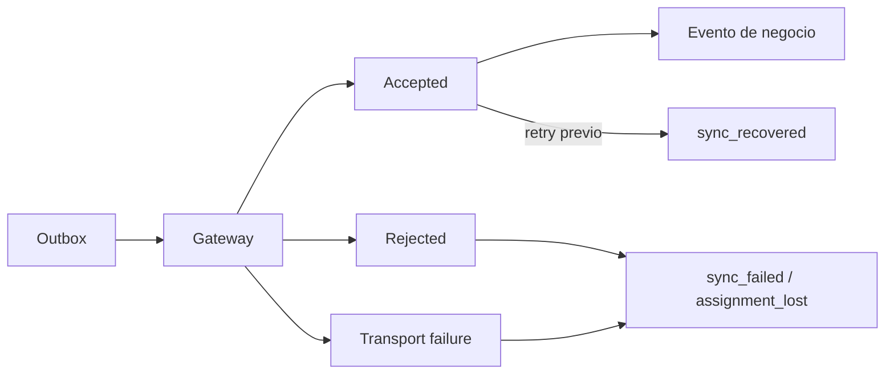

# Observabilidad de Viajes

Fecha: 2026-07-29

Cada comando enviado por el outbox produce un evento estructurado local con:

- `eventType`;
- `eventId`;
- `correlationId`;
- `commandId`;
- `tripId`;
- versión;
- latencia;
- código de error controlado.

No se serializan payloads. El esquema no contiene PIN, teléfono, documento,
dirección, latitud ni longitud. Los identificadores con texto libre o
caracteres inseguros se descartan y los códigos de error solo aceptan
`A-Z`, dígitos y guion bajo.

## Estado de SLO

La instrumentación local permite medir latencia y recuperación durante pruebas.
Todavía no existe un colector productivo aprobado, por lo que no se publican
porcentajes de crash-free, p95 ni disponibilidad inventados. La exportación
futura debe conservar el mismo contrato sin PII y definir retención.

## Centro de Confianza

Los eventos `trust.operation.*` y `trust.realtime.state` usan JSON estructurado
y una correlación común con la aplicación remota. Se registran inicio, éxito,
fallo, latencia, estado de cola, número de elementos, estado WebSocket y ordinal
de reconexión. No se registran correo, nombre, teléfono, licencia, documentos ni
manifiestos de evidencia.

Realtime se mide como transporte, no como autoridad: una señal WebSocket siempre
termina en una lectura REST bajo RLS. El heartbeat de 30 segundos permite
detectar y reparar un evento perdido sin depender del socket.
