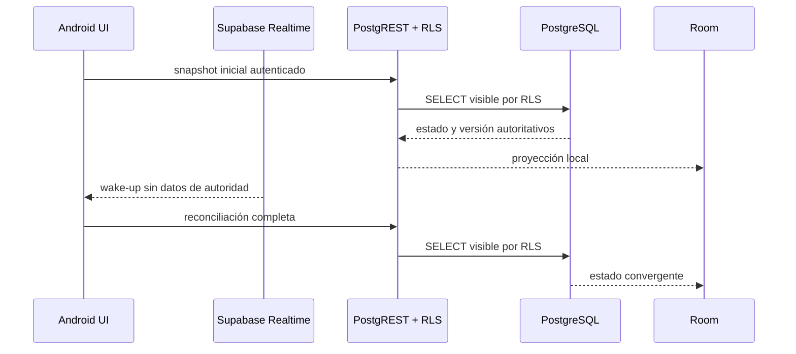

# Fase 7 — Realtime autoritativo y reconciliación

Fecha: 2026-07-29  
Rama: `codex/rides-5-percent-mobility-os`

## Resultado

La pantalla de Viajes mantiene una proyección local de lectura, pero nunca
interpreta un evento Realtime como autoridad comercial. Cada evento solamente
despierta una consulta autenticada sometida a RLS.



## Cobertura implementada

- snapshot inicial al entrar;
- wake-ups de solicitudes, ofertas, paradas y vehículos;
- reconciliación periódica cada 45 segundos mientras la pantalla está activa;
- reconexión exponencial entre 1 y 30 segundos;
- consulta RLS después de cada reconexión;
- compactación de ráfagas mientras una reconciliación está en curso;
- cancelación de canal y heartbeat al salir de Viajes;
- estados visibles `LOCAL`, `CONECTANDO`, `EN VIVO`, `RECUPERANDO` y
  `SIN SESIÓN`;
- ninguna pantalla presenta un estado local pendiente como confirmación del
  servidor.

## Invariantes

1. Realtime no asigna conductores, no acepta ofertas y no inicia viajes.
2. La autoridad permanece en las RPC transaccionales de PostgreSQL.
3. La proyección solo contiene filas visibles según RLS.
4. La pérdida temporal del socket no destruye datos locales ni inventa éxito.
5. El trabajo en segundo plano termina al abandonar la pantalla.

## Verificación

Ejecutado:

```bash
./gradlew :app:testDebugUnitTest \
  --tests 'com.elysium369.meet.ride.*' \
  :app:compileDebugKotlin
```

Resultado: `BUILD SUCCESSFUL`.

La política de reconexión tiene prueba unitaria para crecimiento exponencial y
límite máximo. La validación visual y de pérdida real de red en dispositivo se
realizará en la compuerta final ADB.

## Deuda explícita

- Las notificaciones push requieren un proveedor y credenciales de producción.
- Las métricas SLO deben conectarse a un backend de observabilidad aprobado;
  no se publican cifras inventadas.
