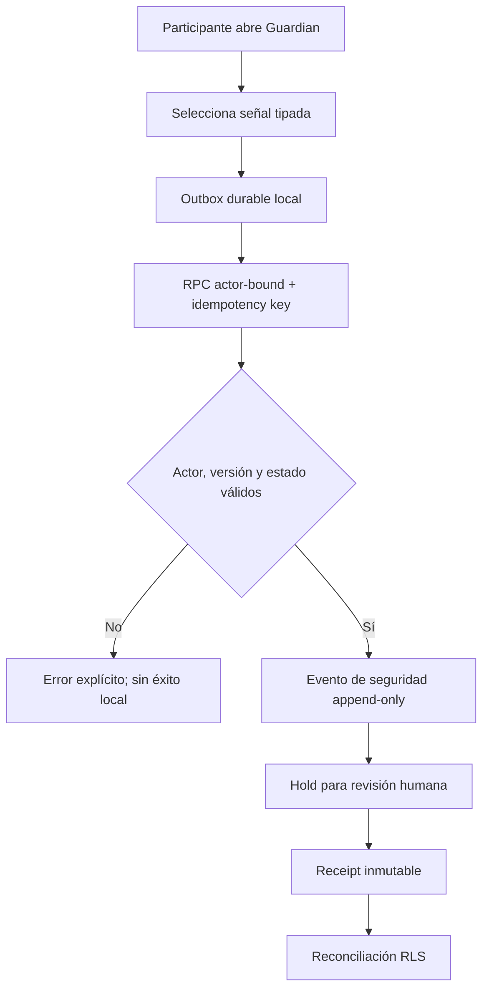

# Elysium Guardian — seguridad de Viajes

Fecha: 2026-07-29

## Alcance

Guardian permite que un pasajero o conductor autenticado registre una señal de
seguridad durante un viaje asignado o en curso. La señal crea evidencia
append-only y una retención operacional para revisión humana.

Guardian **no** afirma que una autoridad, servicio de emergencia o contacto de
confianza fue notificado. La app abre el marcador vacío solo por una acción
explícita de la persona.

## Señales

- SOS;
- solicitud de check-in;
- desvío inesperado;
- parada prolongada;
- posible colisión;
- pérdida de señal;
- vehículo o persona que no coincide;
- acoso o conducta peligrosa;
- situación médica.

## Privacidad

- El registro autoritativo guarda el tipo, severidad y si existió detalle, no
  el texto libre.
- La copia local del payload existe mientras el comando necesita reintentos y
  se redacta automáticamente después del acuse del servidor.
- Compartir estado usa el identificador corto y el estado; no añade teléfono ni
  ubicación exacta.
- La UI activa ya no revela teléfonos reales ni abre llamadas directas a la
  contraparte. Hasta integrar un proveedor de números enmascarados, se usa chat
  y nota de voz dentro del viaje.

## Autoridad y concurrencia

La RPC valida:

1. sesión autenticada;
2. pasajero o conductor asignado;
3. versión actual del viaje;
4. estado activo;
5. señal incluida en el catálogo;
6. idempotencia por actor.

La señal no cambia el estado ni la versión del viaje, por lo que no puede
interrumpir la finalización. El hold es evidencia para revisión, no una
declaración automática de culpabilidad.

## Pruebas

`tests/ride/ride-guardian-safety-integration.sql` verifica éxito, replay,
conflicto de idempotencia, rechazo de un tercero, bloqueo de escritura directa,
ausencia del texto privado en la tabla de eventos y que nunca se marque
contacto con autoridades.

La suite completa conserva la prueba concurrente de 100 conductores con un
único ganador.

## Pendiente de proveedor

- llamada enmascarada;
- contactos de confianza verificados;
- push crítico;
- centro de soporte con SLA;
- integración de emergencias aprobada por país.

Estos puntos no se simulan en producción ni se presentan como disponibles.
