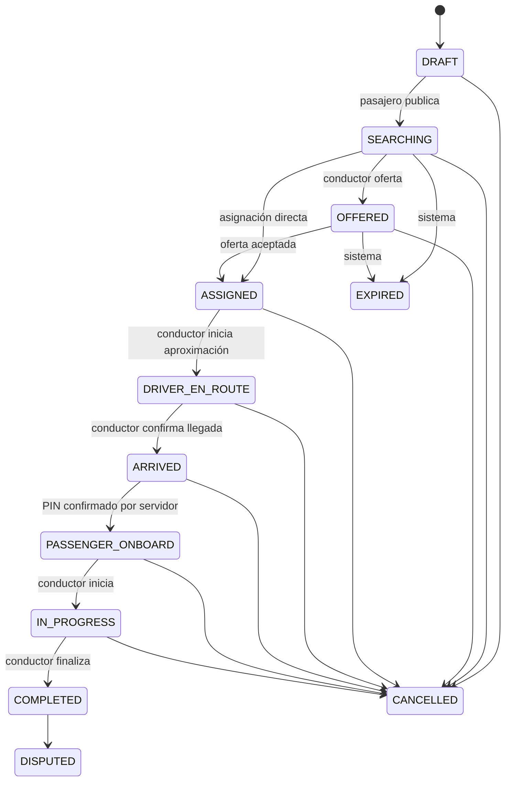

# Máquina de estados de Viajes

## Estados canónicos

`DRAFT`, `SEARCHING`, `OFFERED`, `ASSIGNED`, `DRIVER_EN_ROUTE`, `ARRIVED`,
`PASSENGER_ONBOARD`, `IN_PROGRESS`, `COMPLETED`, `CANCELLED`, `EXPIRED`,
`DISPUTED`.

`SAFETY_HOLD` se modelará como una restricción/incident hold asociado al viaje,
no como un atajo que permita saltar la máquina financiera.

## Invariantes

- Un viaje tiene como máximo un conductor asignado.
- La versión esperada debe coincidir para mutaciones CAS.
- Solo el pasajero propietario, conductor asignado o rol operativo explícito
  puede solicitar una transición.
- La identidad real se obtiene en el servidor; un `actorId` de Android es dato
  no confiable.
- `PASSENGER_ONBOARD` requiere un challenge server-side vigente, no reutilizado
  y verificado.
- Un estado terminal no vuelve a un estado activo.
- Completar es idempotente y produce como máximo una liquidación.
- Cancelar libera reservas mediante una operación idempotente.
- Un hold de seguridad no impide finalizar físicamente ni pedir emergencia.
- `SAFETY_HOLD` histórico se migra a `ride_operational_holds`; no es un estado.
- Claim, cancel y complete toman lock, validan `expected_version` y serializan
  por actor + idempotency key.

## Contrato de error

Los comandos devuelven códigos estables: `UNAUTHENTICATED`, `FORBIDDEN`,
`NOT_FOUND`, `VERSION_CONFLICT`, `INVALID_TRANSITION`, `PIN_REQUIRED`,
`PIN_INVALID`, `PIN_LOCKED`, `ALREADY_ASSIGNED`, `ALREADY_SETTLED`,
`INSUFFICIENT_BALANCE`, `IDEMPOTENCY_CONFLICT`, `FARE_QUOTE_REQUIRED`,
`CURRENCY_MISMATCH`, `AMOUNT_OVERFLOW`, `PROVIDER_UNAVAILABLE` y
`VALIDATION_ERROR`.

La UI traduce el código; no interpreta mensajes SQL ni convierte un fallo en
éxito local. Una respuesta aceptada incluye un `correlation_id` estable y su
replay devuelve exactamente la respuesta almacenada.
