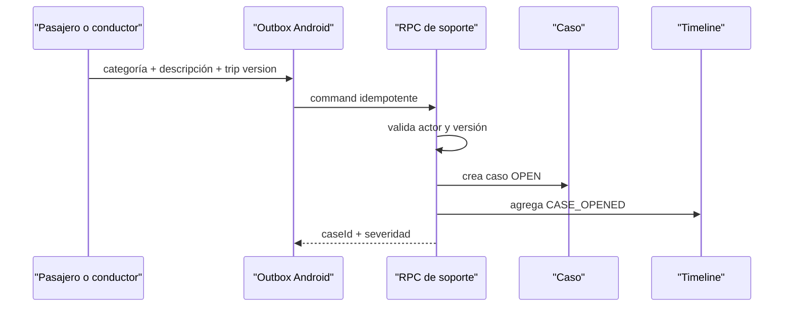

# Soporte y disputas de Viajes

Fecha: 2026-09-18

## Flujo autoritativo

Perfil → Soporte permite escoger un viaje confirmado, una categoría tipada y
una descripción de 10 a 1.000 caracteres. Los viajes únicamente locales
permanecen deshabilitados porque no existe un agregado remoto que soporte el
caso.

## Categorías

Objeto perdido, cobro, identidad de conductor o pasajero, ruta, accidente,
cancelación, pago, comisión, documento, comportamiento y otros.

## Módulo Directo de Objetos Olvidados (Lost & Found)

A partir de la versión 4.26.0, se habilita un canal directo dentro del viaje activo, en el resumen de viaje finalizado y en el detalle del historial (`RideHistoryDetailDialog` y `RideLostAndFoundDialog`) para coordinar la restitución de pertenencias olvidadas con políticas transparentes que dignifican el trabajo del conductor:

- **Tarifa dentro de 10 km:** ₡3.500 CRC dentro de un radio de 10 km medidos desde la ubicación del chofer al momento de la solicitud.
- **Tarifa superior a 10 km:** ₡7.000 CRC para distancias mayores a 10 km desde la posición del chofer.
- **Canal de Contacto:** El pasajero describe el objeto, acepta formalmente la compensación al chofer por su tiempo y combustible, y se enlaza por mensajería o llamada directa.

El reporte se guarda como mensaje del chat del `ride_request_id` confirmado y se sincroniza con `public.ride_messages`. El centro del conductor abre esa conversación histórica y ofrece llamada solamente si existe un teléfono capturado. El aviso local de envío no equivale a acuse de lectura o entrega; el usuario debe comprobar el estado en el chat. Este flujo no crea por sí solo un caso de soporte ni cobra automáticamente la tarifa.

La migración `20260918173552_ride_chat_actor_role_guard.sql` impide que un participante inserte o actualice mensajes atribuidos al rol contrario; `20260918174056_ride_chat_message_immutability.sql` rechaza cualquier reescritura del contenido, viaje o fecha después del primer envío. Room conserva el esquema 77: `RideChatMessageEntity` y su DAO ya almacenaban los mensajes asociados a `rideRequestId`; la nueva consulta de reportes solo lee datos existentes, por lo que no corresponde incrementar la versión local ni generar una migración vacía.

## Invariantes

- Solo un participante puede abrir el caso.
- La versión del viaje debe coincidir.
- Repetir la misma clave devuelve el mismo `caseId`.
- El timeline es append-only.
- Android no asigna ni resuelve casos localmente.
- Soporte no edita asientos financieros. Un ajuste futuro solamente puede
  referenciar una transacción compensatoria autorizada del ledger.
- RLS limita caso y timeline a participantes.

## Estado honesto

Esta entrega crea y audita casos. Asignación a agentes, SLA, adjuntos cifrados,
resoluciones, apelaciones y notificaciones push requieren el backend operativo
y proveedor correspondientes; no se simulan como completados.
