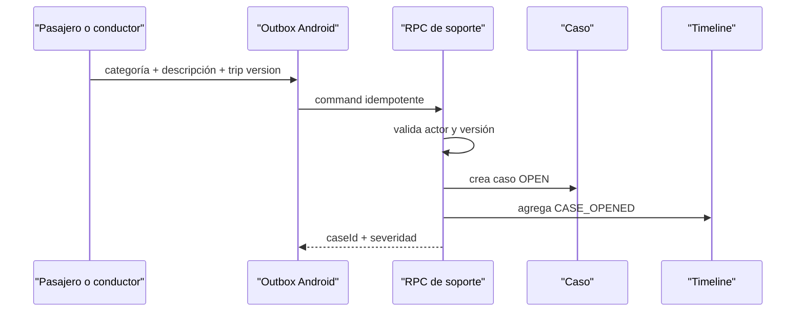

# Soporte y disputas de Viajes

Fecha: 2026-07-29

## Flujo autoritativo

Perfil → Soporte permite escoger un viaje confirmado, una categoría tipada y
una descripción de 10 a 1.000 caracteres. Los viajes únicamente locales
permanecen deshabilitados porque no existe un agregado remoto que soporte el
caso.

## Categorías

Objeto perdido, cobro, identidad de conductor o pasajero, ruta, accidente,
cancelación, pago, comisión, documento, comportamiento y otros.

## Invariantes

- Solo un participante puede abrir el caso.
- La versión del viaje debe coincidir.
- Repetir la misma clave devuelve el mismo `caseId`.
- El timeline es append-only.
- Android no asigna ni resuelve casos localmente.
- Soporte no edita asientos financieros. Un ajuste futuro solamente puede
  referenciar una transacción compensatoria autorizada del ledger.
- RLS limita caso y timeline a participantes.

## Estado honesto

Esta entrega crea y audita casos. Asignación a agentes, SLA, adjuntos cifrados,
resoluciones, apelaciones y notificaciones push requieren el backend operativo
y proveedor correspondientes; no se simulan como completados.
