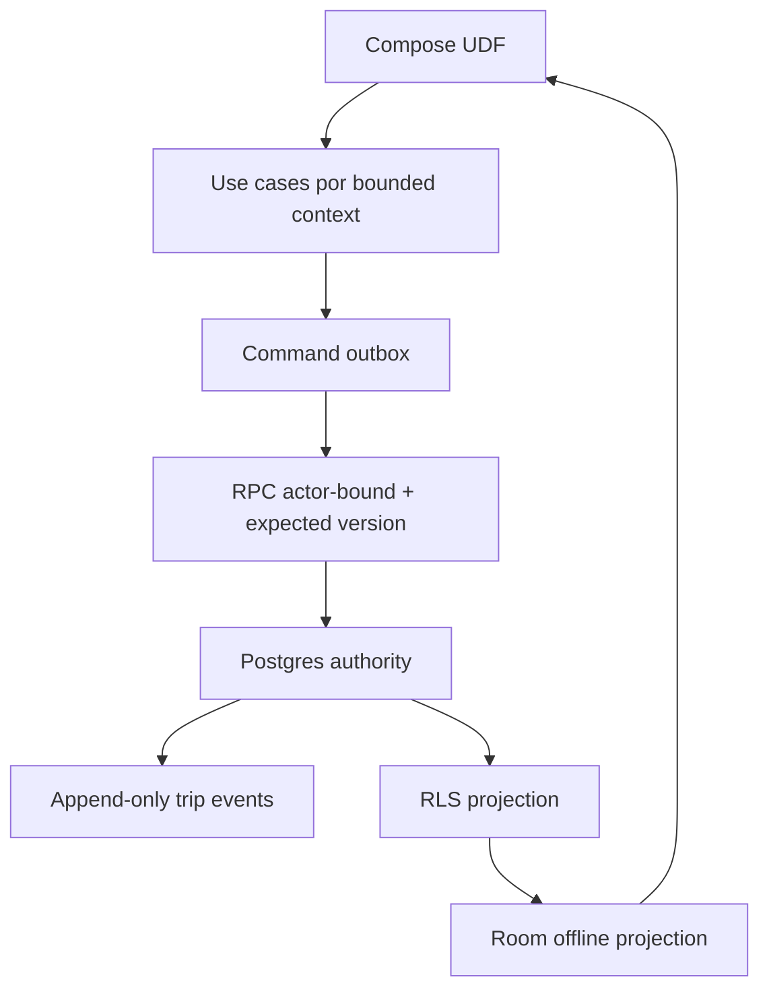

# Viajes V5 — Architecture

La migración desde `ObdViewModel` será incremental hacia `booking`, `pricing`, `trip`, `safety`, `sharing`, `reputation`, `history`, `communication`, `support` y `payment`. No se crea una segunda máquina de estados.

El contrato tarifario conserva tasas, versión de rate card, métricas planeadas, estimado y política de paradas en la solicitud. Los comandos son idempotentes y el servidor resuelve el actor desde `auth.uid()`.
