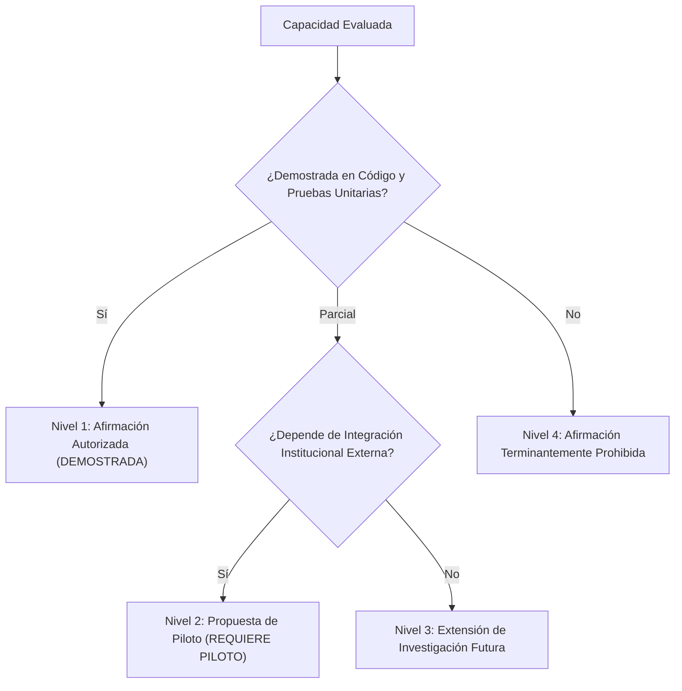

# Elysium Safety — Declaración de Afirmaciones Públicas Autorizadas
## Límites de Comunicación Institucional y Verificación Técnica Probada

> **Destinatarios:** Equipo de Dirección, Portavoces Institucionales, Asesores Parlamentarios y Desarrolladores.  
> **Fecha de Emisión:** Octubre 2026.  
> **Propósito:** Definir taxativamente qué afirmaciones pueden formularse públicamente y ante la Asamblea Legislativa de Costa Rica con base en el código físicamente verificado, cuáles requieren un piloto formal y cuáles están terminantemente prohibidas.

---

### 1. Marco de Integridad de la Comunicación

Para mantener los más altos estándares de credibilidad y ética jurídica ante las instituciones del Estado costarricense (Ministerio de Seguridad Pública, OIJ, Fiscalía General y Poder Judicial), la comunicación pública de **Elysium Safety** se rige por la regla de **honestidad demostrada**:

$$\text{Toda afirmación debe corresponder a código ejecutable y pruebas reproducibles en el repositorio.}$$

---

### 2. Categorización de Afirmaciones

---

### 3. Nivel 1: Afirmaciones Plenamente Autorizadas (Capacidades Demostradas)

Estas capacidades están implementadas en Kotlin/Jetpack Compose, Room, funciones criptográficas y TypeScript con pruebas reproducibles que respaldan su funcionamiento:

1. **Captura y estructuración de incidentes:**
   * *Autorizado afirmar:* "Elysium Safety permite al ciudadano estructurar información de incidentes de seguridad en 8 categorías tipificadas (asaltos, homicidios, desapariciones, situaciones sospechosas, violencia, narcotráfico, emergencias e incidentes territoriales), registrando por separado la hora del acontecimiento y la hora del reporte."
2. **Custodia criptográfica de archivos originales:**
   * *Autorizado afirmar:* "El sistema calcula huellas criptográficas SHA-256 sobre los bytes originales de fotos, videos y documentos. Cualquier alteración de incluso un byte en el archivo rompe la coincidencia matemática y activa una alerta inmediata de inconsistencia."
3. **Honestidad epistémica y separación de certeza:**
   * *Autorizado afirmar:* "La plataforma distingue formalmente entre lo que un ciudadano reportó (`OBSERVED`) y lo que una autoridad competente validó (`AUTHORITATIVE`). Un reporte ciudadano nunca es clasificado internamente como hecho judicialmente probado ni como delito formal."
4. **Cadena lógica de evidencia:**
   * *Autorizado afirmar:* "La arquitectura relaciona formalmente: Evento $\to$ Afirmación $\to$ Hipótesis $\to$ Evidencia $\to$ Análisis $\to$ Conclusión, preservando contradicciones y permitiendo rastrear el origen de cada dato."
5. **Georreferenciación con protección de vida:**
   * *Autorizado afirmar:* "El mapa de la plataforma agrupa incidentes territorialmente y aplica un desenfoque de al menos 25 kilómetros en la vista residencial pública para evitar la identificación o represalias contra víctimas y personas que reportan."
6. **Salvaguarda contra criminalización por riqueza visible:**
   * *Autorizado afirmar:* "El sistema cuenta con una regla estricta que rechaza denuncias basadas únicamente en la ostentación de bienes, vehículos de lujo o estilo de vida visible si no existe un nexo documental auténtico e independiente."
7. **Aislamiento para presentación parlamentaria:**
   * *Autorizado afirmar:* "Elysium Safety cuenta con un modo institucional dedicado que presenta exclusivamente las herramientas de seguridad, evidencia y análisis territorial, sin mezclar módulos comerciales ni diagnósticos automotrices en la experiencia de las autoridades."

---

### 4. Nivel 2: Afirmaciones Condicionadas (Requieren Piloto Institucional)

Estas capacidades requieren convenios, protocolos de interoperabilidad y validación de campo con autoridades públicas:

1. **Recepción automatizada en despacho policial u OIJ:**
   * *Formulación requerida:* "El sistema está diseñado para generar un expediente digital estandarizado con código QR y manifiesto SHA-256 que **podría ser entregado** a las autoridades en el marco de un piloto formal."
   * *Prohibido afirmar:* "La policía o el OIJ ya reciben automáticamente los reportes en sus sistemas de despacho."
2. **Impacto en reducción delictiva:**
   * *Formulación requerida:* "La tecnología busca proporcionar mejor información estructurada para apoyar la toma de decisiones preventivas de las instituciones."
   * *Prohibido afirmar:* "Elysium Safety reduce los homicidios o los asaltos en un porcentaje específico."
3. **Validez jurídica en juicio:**
   * *Formulación requerida:* "El sistema genera elementos técnicos de trazabilidad e integridad de archivos que **facilitan a los peritos judiciales verificar si un archivo original fue alterado**, conforme a las reglas generales de la prueba científica."
   * *Prohibido afirmar:* "Los reportes de Elysium Safety tienen plena validez probatoria automática en los tribunales sin necesidad de peritaje judicial."

---

### 5. Nivel 3: Extensiones de Investigación Futuras (Inteligencia Financiera)

* **Línea de Inteligencia Financiera y Contratación Pública (SICOP):**
  * *Formulación requerida:* "Se ha desarrollado de forma modular e independiente una herramienta analítica de cruce de datos de compras públicas (SICOP) orientada al periodismo de investigación y la auditoría ciudadana, basada en reglas matemáticas deterministas y fuentes públicas lícitas."
  * *Condición:* No debe presentarse a los diputados como parte del piloto inicial de seguridad en barrios y comunidades, sino como una capacidad analítica complementaria disponible para comisiones investigadoras o auditores.

---

### 6. Nivel 4: Afirmaciones Terminantemente Prohibidas (Límites Inviolables)

Bajo ninguna circunstancia ningún representante de Elysium Vanguard / MEET podrá formular las siguientes declaraciones:

| Afirmación Prohibida | Razón Técnica y Jurídica |
|---|---|
| *"Elysium Safety determina quién es culpable."* | FALSO. La culpabilidad penal es competencia exclusiva de los Tribunales de la República de Costa Rica. |
| *"La IA del sistema analiza si una persona es criminal."* | FALSO y PROHIBIDO por la Constitución Política de Costa Rica. El sistema no elabora perfiles criminales de individuos. |
| *"Un marcador en el mapa demuestra que ocurrió un delito."* | FALSO. Un marcador refleja un reporte ciudadano recibido (`OBSERVED`), no una sentencia judicial firme. |
| *"Nuestra tecnología reemplaza a la policía o a la fiscalía."* | FALSO. Proporciona infraestructura tecnológica de soporte para preservar datos, no funciones policiales ni jurisdiccionales. |
| *"La evidencia es inmutable en el sentido de que lo escrito es verdad."* | FALSO. La criptografía prueba que el archivo digital no fue modificado; no prueba que el testigo esté diciendo la verdad. |
| *"Ya tenemos un despliegue nacional activo en el gobierno."* | FALSO. Cualquier despliegue requiere aprobación formal, marco legal y acuerdos interinstitucionales. |

---

### 7. Frase Solemne de Apertura Institucional Aprobada

Para toda reunión con la Asamblea Legislativa, ministerios o cuerpos de investigación, la exposición debe abrirse con la siguiente declaración oficial:

> *“Elysium Safety no pretende reemplazar a las autoridades ni decidir quién es culpable. Pretende resolver un problema anterior: cómo capturar, preservar, estructurar y analizar información de seguridad para que la evidencia no se pierda y pueda llegar a las instituciones competentes con trazabilidad.”*
