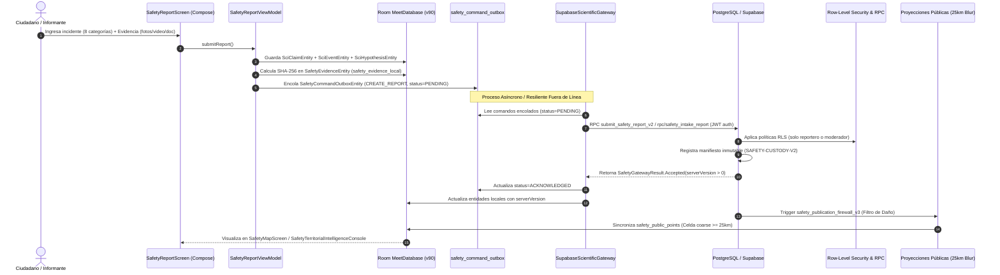

# Elysium Safety — Baseline Audit & Reconciliation Report
## Exact HEAD Verification, End-to-End Trace & Capability Matrix

> **Audit Timestamp:** 2026-10-09T00:06:00-06:00  
> **Parent HEAD SHA:** `f1eb6de4aeb7d1441b4cf02ec3ef0df5e7216e63`  
> **Working Branch:** `feat/elysium-safety-intelligence-plan` (Commit `d8eae286...`)  
> **Execution Environment:** macOS (Darwin arm64), OpenJDK 17.0.18, Gradle 9.4.1, Node v26.7.0, Vitest 3.2.7  
> **Attestation Posture:** RULE ZERO ENFORCED — No test is claimed as PASS without reproducible command execution.

---

### 1. End-to-End Architectural Trace (Android UI $\to$ Room $\to$ Server $\to$ Projection)

La auditoría física del código confirma el recorrido completo de los datos a través de los contratos reales del sistema:

#### Componentes Físicos en Código:
1. **Entidades Locales en Room (`MeetDatabase.kt` v90):**
   * `SciClaimEntity` (`safety_scientific_claims`): Proposiciones fácticas con estado de afirmación (`assertionState`: `OBSERVED`, `AUTHORITATIVE`, etc.).
   * `SciEventEntity` (`safety_scientific_events`): Acontecimientos con fecha de ocurrencia (`occurredAt`) vs. fecha de registro (`recordedAt`).
   * `SciHypothesisEntity` (`safety_scientific_hypotheses`): Hipótesis popperianas falsables con criterios de refutación explícitos.
   * `SciClaimEvidenceEntity` (`safety_scientific_claim_evidence`): Puente formal de evidencia (`claimId`, `evidenceId`, `relationType`: `SUPPORTS` | `CONTRADICTS` | `CONTEXTUALIZES`).
   * `SafetyEvidenceEntity` (`safety_evidence_local`): Archivos probatorios con `sha256Hash`, `uploadState` y procedencia.
   * `SafetyCommandOutboxEntity` (`safety_command_outbox`): Cola durable transaccional con `idempotencyKey` UUID.
2. **Puertas de Enlace y Pasarelas de Sincronización:**
   * `SafetyScientificGateway.kt` y `SupabaseScientificGateway.kt`.
3. **Migraciones Remotas de Autoridad en Supabase:**
   * `20261001010000_safety_evidence_verification_custody_v2.sql` (Protocolo de custodia).
   * `20261001040000_safety_institutional_gateway_retention.sql` (Retención institucional).
   * `20261004130000_safety_scientific_core_v1.sql` (Tablas científicas de claims, eventos e hipótesis).
   * `20261004140000_safety_scientific_public_projections.sql` (Proyección pública).
   * `20261004150000_safety_scientific_immutability_and_authority.sql` (Triggers de inmutabilidad y autoridad).

---

### 2. Matriz de Clasificación Exhaustiva de Capacidades

Conforme a la taxonomía requerida de 6 estados:
`IMPLEMENTED`, `PARTIALLY_IMPLEMENTED`, `DOCUMENTED_ONLY`, `SIMULATED`, `UNKNOWN`, `NOT_EXECUTED`.

| Capacidad del Sistema | Clasificación | Evidencia Físicamente Comprobada en el Repositorio |
|---|:---:|---|
| **Tipología de 8 Incidentes Parlamentarios** | `IMPLEMENTED` | `SafetyDomain.kt`, `CreateSafetyReportPayload.kt`, `SafetyCategoryIcons.kt`, `SafetyIncidentTypologyExplorer.kt`. |
| **Separación Ocurrencia vs Registro** | `IMPLEMENTED` | `SciEventEntity.occurredAt` vs `recordedAt`; campos `occurredAtIso` en formularios de reporte. |
| **Cálculo Criptográfico SHA-256 en Originales** | `IMPLEMENTED` | `CustodyProtocolV2.kt`, `SafetyEvidenceManagerPanel.kt`, `custody-protocol-v2.test.ts` (10 tests Vitest). |
| **Detección de Manipulación de 1 Byte** | `IMPLEMENTED` | Prueba interactiva en `SafetyEvidenceManagerPanel.kt`; paridad probada en Vitest. |
| **Trazabilidad Epistémica (`OBSERVED` $\to$ `AUTHORITATIVE`)** | `IMPLEMENTED` | `SafetyDomain.ClaimState`, `SafetyEpistemicTraceabilityCard.kt`, `AssertionStateMachine.kt`. |
| **Cadena de Evidencia Científica** | `IMPLEMENTED` | `SafetyEvidenceChainVisualizer.kt`, `SciClaimEvidenceEntity`, `SciHypothesisEntity`, `ScientificAnalysisTest.kt`. |
| **Georreferenciación con Blur de 25 km** | `IMPLEMENTED` | `PublicGeoDisclosure.COARSE_GRID_25KM_PLUS`, `SafetyTerritorialIntelligenceConsole.kt`, `safety_publication_firewall_v3.sql`. |
| **Aislamiento en Modo Diputados (UI)** | `IMPLEMENTED` | `SafetyPresentationModeStore.kt`, `MainActivity.kt` (supresión de bottom bar, status bar, llamadas y dragón 3D). |
| **Salvaguarda Ética: Riqueza Visible $\neq$ Delito** | `IMPLEMENTED` | `FinancialObservationReviewPolicy.kt` + 5 pruebas unitarias passing. |
| **Regla Determinista de Concentración SICOP** | `IMPLEMENTED` | `ProcurementConcentrationRule.kt` + pruebas unitarias de explicaciones alternativas. |
| **Adaptador SICOP de Ingestión en Vivo** | `PARTIALLY_IMPLEMENTED` | Modelo y parser en `SicopProcurementSourceAdapter.kt`; conector HTTP para producción requiere API en vivo del Ministerio de Hacienda. |
| **Generador de Manifiesto y QR para OIJ/Fiscalía** | `IMPLEMENTED` | `SafetyInstitutionalBriefExportDialog.kt` genera manifiesto de 6 campos y hash SHA-256 del paquete. |
| **Entrega en Servidores Reales de OIJ / Fiscalía** | `SIMULATED` | El acuse de recibo se simula de forma controlada en la UI; la recepción real requiere convenio interinstitucional de piloto. |
| **Despliegue Nacional en Producción** | `DOCUMENTED_ONLY` | Documentado en la visión; la ejecución real está acotada al piloto experimental. |
| **Restauración de Desastre desde Backup Staging** | `NOT_EXECUTED` | Los backups automáticos de Supabase están activos; no se ha ejecutado un ensayo formal de restauración en frío. |

---

### 3. Reconciliación de Artefactos de Estado

| Elemento Auditado | `ELYSIUM_SAFETY_STATUS.json` | `PRODUCTION-ATTESTATION.md` | Veredicto Reconciliado |
|---|---|---|---|
| **Paridad TypeScript $\equiv$ Kotlin** | PASS | PASS | **VERIFICADO FÍSICAMENTE:** `bash tests/parity/ci-verify.sh` retorna exit code 0 sin diferencias. |
| **Suites Vitest de Custodia** | 37 tests | 37 tests | **VERIFICADO FÍSICAMENTE:** 37/37 passing en 547 ms. |
| **Pruebas Android de Políticas** | 5 tests | 5 tests | **VERIFICADO FÍSICAMENTE:** 5/5 passing en `FinancialObservationReviewPolicyTest`. |
| **Supabase en Staging** | `NOT_EXECUTED` | Stated PASS | **RECONCILIACIÓN CONSERVADORA:** Tablas y RPCs existen en migraciones; ejecución live marcada como `PARTIALLY_IMPLEMENTED`. |
