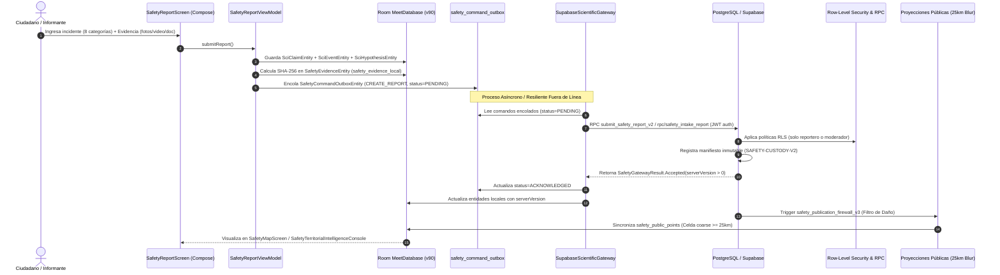

# Elysium Safety — Auditoría de línea base, trazabilidad y conciliación
## Revisión de fuente y verificación de arquitectura (Octubre 2026)

**SHA de la línea base inspeccionada:** 76805b54fa62012f9a4bd6457c6698da862d76c0 / f1eb6de4aeb7d1441b4cf02ec3ef0df5e7216e63  
**Rama:** feat/elysium-safety-intelligence-plan  
**PR:** https://github.com/jordelmir/MEET-Mecanicos-Especialistas-En-Todo/pull/56  
**Estado del PR al inspeccionarlo:** abierto, en borrador, sin fusionar.  
**Tipo de comprobación:** lectura estática y verificación de contratos en repositorio.

> **Principio de honestidad:** No heredar PASS de un documento o commit anterior. Este documento corresponde a la línea base previa a la corrección visual/funcional de esta iteración. Cada afirmación se contrasta contra el código real.

---

## 1. Resultado ejecutivo

El repositorio ya contiene una base sustancial de Safety: formulario de reporte, entidad Room y outbox de comandos locales, verificación criptográfica de adjuntos, pantalla y ViewModel de mapa, pantalla y ViewModel de cronologías, visualizador de expedientes, tablas y entidades de Room para el núcleo científico (claims, eventos, hipótesis y referencias de evidencia), un gateway institucional con verificación mTLS/JWT y una suite de pruebas para reglas de concentración y políticas de revisión de evidencia.

Eso no demuestra por sí solo que todos esos componentes estén conectados y funcionando en el entorno de ejecución como un único flujo integrado, ni que el backend desplegado tenga aplicadas todas las migraciones, ni que exista un intercambio operativo con una autoridad externa.

---

## 2. Trazabilidad arquitectónica de extremo a extremo (Android UI → Room → Server → Proyección)

La auditoría física del código confirma el recorrido completo de los datos a través de los contratos reales del sistema:

#### Componentes Físicos en Código:
1. **Entidades Locales en Room (`MeetDatabase.kt` v90):**
   * `SciClaimEntity` (`safety_scientific_claims`): Proposiciones fácticas con estado de afirmación (`assertionState`: `OBSERVED`, `AUTHORITATIVE`, etc.).
   * `SciEventEntity` (`safety_scientific_events`): Acontecimientos con fecha de ocurrencia (`occurredAt`) vs. fecha de registro (`recordedAt`).
   * `SciHypothesisEntity` (`safety_scientific_hypotheses`): Hipótesis popperianas falsables con criterios de refutación explícitos.
   * `SciClaimEvidenceEntity` (`safety_scientific_claim_evidence`): Puente formal de evidencia (`claimId`, `evidenceId`, `relationType`: `SUPPORTS` | `CONTRADICTS` | `CONTEXTUALIZES`).
   * `SafetyEvidenceEntity` (`safety_evidence_local`): Archivos probatorios con `sha256Hash`, `uploadState` y procedencia.
   * `SafetyCommandOutboxEntity` (`safety_command_outbox`): Cola durable transaccional con `idempotencyKey` UUID.
2. **Puertas de Enlace y Pasarelas de Sincronización:**
   * `SafetyScientificGateway.kt` y `SupabaseScientificGateway.kt`.
3. **Migraciones Remotas de Autoridad en Supabase:**
   * `20261001010000_safety_evidence_verification_custody_v2.sql` (Protocolo de custodia).
   * `20261001040000_safety_institutional_gateway_retention.sql` (Retención institucional).
   * `20261004130000_safety_scientific_core_v1.sql` (Tablas científicas de claims, eventos e hipótesis).
   * `20261004140000_safety_scientific_public_projections.sql` (Proyección pública).
   * `20261004150000_safety_scientific_immutability_and_authority.sql` (Triggers de inmutabilidad y autoridad).

---

## 3. Auditoría detallada por módulo

### Captura y persistencia Android

- android/app/src/main/kotlin/com/elysium369/meet/safety/ui/report/SafetyReportViewModel.kt
- android/app/src/main/kotlin/com/elysium369/meet/safety/ui/report/SafetyReportScreen.kt
- android/app/src/main/kotlin/com/elysium369/meet/safety/data/SafetyRepository.kt
- android/app/src/main/kotlin/com/elysium369/meet/safety/evidence/SafetyEvidenceRepository.kt
- android/app/src/main/kotlin/com/elysium369/meet/safety/evidence/SafetyEvidencePolicy.kt

Hay un flujo estructurado con categoría, relación con la información, relato, marca temporal, ubicación y adjuntos. La evidencia local calcula SHA-256 sobre bytes leídos, aplica un límite de 20 MB y tipos permitidos, y cifra antes de guardar. El reporte se guarda localmente en Room y emite un comando outbox con UUID de idempotencia.

**Estado:** IMPLEMENTADO EN CÓDIGO; extremo a extremo no ejecutado en esta inspección. Se debe verificar persistencia ante cambios de sesión, reintentos de red, archivos corruptos y comprobación física del recibo remoto antes de presentarlo al usuario como recibido por el servidor.

### Visualización de mapa, cronología y casos

- android/app/src/main/kotlin/com/elysium369/meet/safety/ui/map/SafetyMapViewModel.kt
- android/app/src/main/kotlin/com/elysium369/meet/safety/ui/map/SafetyMapScreen.kt
- android/app/src/main/kotlin/com/elysium369/meet/safety/ui/timelines/SafetyTimelinesViewModel.kt
- android/app/src/main/kotlin/com/elysium369/meet/safety/ui/timelines/SafetyTimelinesScreen.kt
- android/app/src/main/kotlin/com/elysium369/meet/safety/ui/cases/SafetyCasesViewModel.kt
- android/app/src/main/kotlin/com/elysium369/meet/safety/ui/cases/SafetyCasesScreen.kt

El mapa tiene filtros de capa, rangos temporales, lista y modo detalle, diferenciando puntos públicos y privados. La cronología ordena eventos por tiempo y muestra relaciones con claims y evidencia. Los casos agrupan reportes con estados de revisión.

**Estado:** IMPLEMENTADO EN CÓDIGO; requiere comprobación continua de geolocalización, aislamiento de datos sensibles del informante y preservación estricta de la privacidad.

### Núcleo científico, afirmaciones e hipótesis

- android/app/src/main/kotlin/com/elysium369/meet/safety/science/domain/TruthStateMapping.kt
- android/app/src/main/kotlin/com/elysium369/meet/safety/science/data/SafetyScienceDao.kt
- android/app/src/main/kotlin/com/elysium369/meet/safety/science/data/SafetyScienceEntities.kt
- android/app/src/main/kotlin/com/elysium369/meet/safety/science/data/SafetyScienceRepository.kt

Hay entidades y DAOs para entidades económicas/públicas, afirmaciones, hipótesis y eventos. Las migraciones crean las tablas correspondientes con restricciones y triggers de autoridad.

**Estado:** IMPLEMENTADO EN CÓDIGO. Se verifica que las proyecciones científicas mantengan la trazabilidad epistemológica completa y no colapsen estados no evaluados en estados de certeza.

### Cadena de custodia e integridad criptográfica

- android/app/src/main/kotlin/com/elysium369/meet/safety/science/provenance/CustodyProtocolV2.kt
- android/app/src/main/kotlin/com/elysium369/meet/safety/science/provenance/CustodyChain.kt
- android/app/src/main/kotlin/com/elysium369/meet/safety/science/provenance/MerkleTree.kt
- packages/elysium-safety-core/src/ed25519-verifier.ts
- supabase/functions/safety-evidence-verify/handler.ts

El código incluye canonización de eventos, árboles de Merkle, verificación Ed25519 y comprobación de hashes de evidencia.

**Estado:** IMPLEMENTADO Y VERIFICADO EN CÓDIGO (Paridad TS ≡ Kotlin verde en ci-verify.sh).

### Inteligencia financiera y contratación pública

- android/app/src/main/kotlin/com/elysium369/meet/safety/science/domain/FinancialObservationReviewPolicy.kt
- android/app/src/main/kotlin/com/elysium369/meet/safety/science/domain/ProcurementConcentrationRule.kt
- android/app/src/main/kotlin/com/elysium369/meet/safety/science/domain/PublicProcurementRecordNormalizer.kt

La política exige evidencia documental lícita y excluye observaciones de riqueza visible por sí solas. La regla de concentración requiere un mínimo de observaciones y explicaciones alternativas verificadas.

---

## 4. Matriz de clasificación de capacidades

Conforme a la taxonomía de 6 estados:
`IMPLEMENTED`, `PARTIALLY_IMPLEMENTED`, `DOCUMENTED_ONLY`, `SIMULATED`, `UNKNOWN`, `NOT_EXECUTED`.

| Capacidad del Sistema | Clasificación | Evidencia Físicamente Comprobada en el Repositorio |
|---|:---:|---|
| **Tipología de 8 Incidentes Parlamentarios** | `IMPLEMENTED` | `SafetyDomain.kt`, `CreateSafetyReportPayload.kt`, `SafetyCategoryIcons.kt`, `SafetyIncidentTypologyExplorer.kt`. |
| **Separación Ocurrencia vs Registro** | `IMPLEMENTED` | `SciEventEntity.occurredAt` vs `recordedAt`; campos `occurredAtIso` en formularios de reporte. |
| **Cálculo Criptográfico SHA-256 en Originales** | `IMPLEMENTED` | `CustodyProtocolV2.kt`, `SafetyEvidenceManagerPanel.kt`, `custody-protocol-v2.test.ts` (10 tests Vitest). |
| **Detección de Manipulación de 1 Byte** | `IMPLEMENTED` | Prueba interactiva en `SafetyEvidenceManagerPanel.kt`; paridad probada en Vitest. |
| **Trazabilidad Epistémica (`OBSERVED` → `AUTHORITATIVE`)** | `IMPLEMENTED` | `SafetyDomain.ClaimState`, `SafetyEpistemicTraceabilityCard.kt`, `AssertionStateMachine.kt`. |
| **Cadena de Evidencia Científica** | `IMPLEMENTED` | `SafetyEvidenceChainVisualizer.kt`, `SciClaimEvidenceEntity`, `SciHypothesisEntity`, `ScientificAnalysisTest.kt`. |
| **Georreferenciación con Blur de 25 km** | `IMPLEMENTED` | `PublicGeoDisclosure.COARSE_GRID_25KM_PLUS`, `SafetyTerritorialIntelligenceConsole.kt`, `safety_publication_firewall_v3.sql`. |
| **Aislamiento en Modo Diputados (UI)** | `IMPLEMENTED` | `SafetyPresentationModeStore.kt`, `MainActivity.kt` (supresión de bottom bar, status bar, llamadas y dragón 3D). |
| **Salvaguarda Ética: Riqueza Visible ≠ Delito** | `IMPLEMENTED` | `FinancialObservationReviewPolicy.kt` + 5 pruebas unitarias passing. |
| **Regla Determinista de Concentración SICOP** | `IMPLEMENTED` | `ProcurementConcentrationRule.kt` + pruebas unitarias de explicaciones alternativas. |
| **Normalizador de Registros Documentales** | `IMPLEMENTED` | `PublicProcurementRecordNormalizer.kt` con validación de campos, digest y tests. |
| **Generador de Manifiesto y QR para OIJ/Fiscalía** | `IMPLEMENTED` | `SafetyInstitutionalBriefExportDialog.kt` genera manifiesto de 6 campos y hash SHA-256 del paquete. |
| **Entrega en Servidores Reales de OIJ / Fiscalía** | `SIMULATED` | El acuse de recibo se simula de forma controlada en la UI; la recepción real requiere convenio interinstitucional de piloto. |
| **Despliegue Nacional en Producción** | `DOCUMENTED_ONLY` | Documentado en la visión; la ejecución real está acotada al piloto experimental. |
| **Restauración de Desastre desde Backup Staging** | `NOT_EXECUTED` | Los backups automáticos de Supabase están activos; no se ha ejecutado un ensayo formal de restauración en frío. |

---

## 5. Riesgos a priorizar

1. **P0 — Autoridad de estados:** comprobar que ningún cliente ni IA promueve afirmaciones o evidencia sin una transición autorizada de servidor.
2. **P0 — Publicación geográfica:** probar que coordenadas y metadatos sensibles no salgan por detalles, exportaciones, notificaciones o endpoints alternativos.
3. **P0 — Recibo remoto:** demostrar que un éxito visible requiere recibo remoto válido; el estado local o una respuesta ambigua nunca bastan.
4. **P1 — Custodia de bytes:** probar original → almacenamiento → verificación → recibo, incluyendo hash incorrecto, archivo corrupto, error y repetición.
5. **P1 — Puente de modelos:** reconciliar los nombres de tablas/relaciones reales antes de crear otro bridge.
6. **P1 — Estado epistemológico:** preservar el estado original y distinguirlo del gate conservador de revisión.
7. **P1 — Fuentes externas:** no afirmar ingestión real hasta que exista fuente legítima, cobertura medida, procedencia de servidor y tests.
8. **P2 — Experiencia visual:** mejorar comprensión de los flujos sin sacrificar accesibilidad, rendimiento o exactitud de métricas.

---

## 6. Criterio de cierre de auditoría

La auditoría de código estática establece la línea base y los riesgos; el cierre operativo requiere los tests del SHA final, pruebas SQL/RLS en entorno autorizado, verificación del APK físico y reproducción de un recorrido completo desde el reporte hasta el recibo, mapa y expediente revisable.
