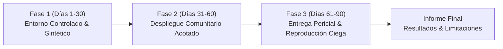

# Elysium Safety — Plan de Piloto Controlado para Costa Rica
## Protocolo Experimental de Verificación Forense, Integridad Territorial y Colaboración Institucional

> **Ámbito Geográfico:** Cantón Central de San José (Distritos Catedral, Hospital, Merced, El Carmen) / Cantón Central de Limón.  
> **Participantes Propuestos:** Fuerza Pública (Ministerio de Seguridad Pública), Organismo de Investigación Judicial (OIJ), observadores del Ministerio Público y organizaciones de la sociedad civil con personería jurídica.  
> **Duración Prevista:** 90 días naturales.  
> **Postura Ética y Metodológica:** Regla Cero de Honestidad Científica. Si durante el piloto la evidencia no permite concluir un patrón territorial o criminal, ese resultado negativo o insuficiente se documenta formalmente.

---

### 1. Objetivos del Piloto

1. **Validación de la Cadena de Custodia Digital:**
   Demostrar que fotografías, videos y documentos aportados en el campo generan una huella SHA-256 exacta sobre sus bytes originales y que cualquier intento de alteración posterior es detectado inequívocamente (`SAFETY-CUSTODY-V2`).
2. **Evaluación de la Protección de Testigos y Víctimas:**
   Comprobar que la dispersión geográfica mínima de 25 km en el mapa público y la supresión de metadatos EXIF impiden la geolocalización de domicilios o la identificación involuntaria de fuentes.
3. **Prueba de Interoperabilidad con Autoridades:**
   Probar la generación y entrega de **Expedientes Forenses Institucionales** con manifiesto criptográfico y código QR de 6 campos a investigadores asignados del OIJ o delegaciones de Fuerza Pública.
4. **Validación de Trazabilidad Epistémica:**
   Demostrar en casos reales o controlados que un reporte ciudadano permanece en estado `OBSERVED` y no se confunde en ningún registro con una imputación formal hasta peritaje oficial (`AUTHORITATIVE`).

---

### 2. Conjunto de Datos y Salvaguardas Jurídicas

* **Modalidad A: Datos Sintéticos y Controlados (Fase 1 - Días 1 a 30):**
  * Incidentes simulados de prueba con actores controlados en vía pública (ej. simulación de hurto de pertenencias, reporte de luminaria dañada o colisión).
  * Fotografías y videos capturados con dispositivos testigo.
* **Modalidad B: Casos Piloto Reales Autorizados (Fase 2 - Días 31 a 90):**
  * Denuncias ciudadanas voluntarias canalizadas con consentimiento informado expreso conforme a la Ley de Protección de la Persona frente al Tratamiento de sus Datos Personales (Ley N.° 8968).
  * Declaración jurada de no interferencia con pesquisas judiciales en curso (Art. 295 del Código Procesal Penal sobre secreto del sumario).

---

### 3. Fases de Ejecución

#### Fase 1: Calibración Técnica y Verificación de Integridad (Días 1–30)
* Despliegue de la versión APK institucional en 20 dispositivos Android de prueba.
* Ejecución del protocolo de cálculo SHA-256 en archivos originales y verificación cruzada en servidor Supabase.
* Comprobación del mecanismo de despojo de metadatos EXIF (marca de cámara, modelo, coordenadas GPS originales).
* Auditoría de aislamiento: Confirmar que ningún módulo automotriz ni comercial sea accesible en los dispositivos de campo.

#### Fase 2: Recepción y Triaje en Zona Piloto (Días 31–60)
* Habilitación de la captura de las 8 tipologías de incidentes estructurados.
* Verificación de persistencia fuera de línea: Simulación de pérdida de cobertura celular y sincronización exitosa posterior vía outbox durable (`safety_command_outbox`).
* Confirmación de que el servidor emite acuses de persistencia con `serverVersion > 0` antes de proyectar cambios.

#### Fase 3: Evaluación de Entrega Pericial y Reproducción Ciega (Días 61–90)
* Selección de 10 expedientes del piloto.
* Generación de expedientes mediante el diálogo institucional (`SafetyInstitutionalBriefExportDialog`).
* **Prueba de Reproducción Forense Ciega:**
  * Un perito o auditor informático independiente recibe el archivo original y el manifiesto.
  * Ejecuta la verificación mediante herramienta de línea de comandos (`sha256sum`).
  * Comprueba si los hashes coinciden con los registrados en la plataforma.
  * Introduce deliberadamente una alteración de 1 byte en uno de los archivos para certificar que el validador rechaza el paquete adulterado.

---

### 4. Criterios de Aceptación y Métricas de Rendimiento

| Métrica | Criterio de Éxito | Método de Medición |
|---|---|---|
| **Integridad Criptográfica** | 100% de coincidencias en archivos inalterados; 0 falsos positivos en alterados | Verificación SHA-256 por segundo revisor independiente |
| **Protección de Privacidad** | 0 filtraciones de coordenadas exactas en la API pública; 100% de celdas $\ge$ 25 km | Análisis de tráfico de red y respuestas JSON públicas |
| **Separación Epistémica** | 0 reportes ciudadanos promovidos a `AUTHORITATIVE` sin firma pericial | Auditoría de estados en base de datos (`safety_scientific_claims`) |
| **Persistencia Fuera de Línea** | 0 pérdidas de reportes almacenados en outbox tras reinicio o pérdida de señal | Prueba de ciclo de vida con apagado forzado del dispositivo |
| **Tiempo de Generación de Manifiesto** | < 3 segundos para expedientes con hasta 25 elementos probatorios | Benchmark en hardware Android estándar |

---

### 5. Documentación Obligatoria de Errores y Limitaciones

El informe final del piloto no ocultará ninguna falla técnica. Deberá incluir una sección explícita con:
* **Falsos positivos detectados:** Casos donde un evento reportado no correspondía a un hecho delictivo real.
* **Limitaciones de cobertura:** Zonas donde la falta de conectividad o de fuentes impidió formular análisis concluyentes.
* **Incidencias de hardware:** Dispositivos o formatos de archivo que experimentaron demoras en el cálculo de huellas.
* **Lecciones aprendidas:** Ajustes necesarios para eventuales despliegues territoriales ampliados.
