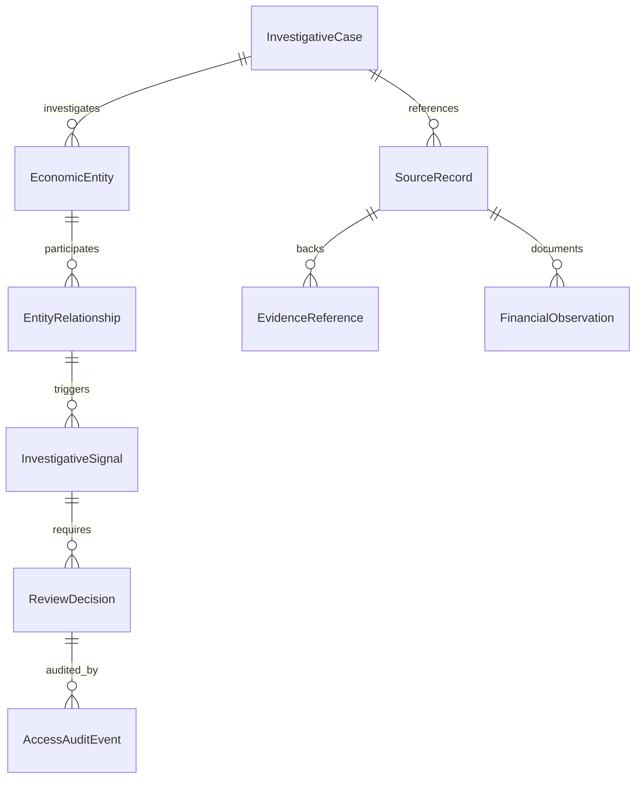

# Elysium Safety — Domain Model & Epistemic Contracts
## Public-Interest Financial Intelligence & Investigative Evidence

> **Epistemic Invariant:**  
> $$\text{OBSERVED} \longrightarrow \text{AUTHORITATIVE} \longrightarrow \text{DERIVED} \longrightarrow \text{ESTIMATED} \longrightarrow \text{UNKNOWN}$$  
> State transitions are unidirectional and require verifiable proof.  
> An allegation, visible lifestyle, or AI inference can never unilaterally promote a state to `AUTHORITATIVE`.

---

## 1. Domain Entities



### 1.1. `InvestigativeCase`
Represents an authorized, bounded investigative workspace.
- `caseId`: UUID (stable identifier).
- `title`: String (descriptive title).
- `purposeAndScope`: String (legal/journalistic rationale; required).
- `responsibleOrganization`: String (institution, newsroom, or research unit).
- `accessClassification`: Enum (`RESTRICTED_INTERNAL`, `CONFIDENTIAL`, `APPROVED_FOR_DISCLOSURE`).
- `lifecycleState`: Enum (`DRAFT`, `SUBMITTED`, `SOURCE_VALIDATION`, `CORROBORATION`, `ANALYST_REVIEW`, `EDITORIAL_REVIEW`, `DISCLOSURE_APPROVED`, `CLOSED_OR_CORRECTED`).
- `createdAt` / `updatedAt`: ISO-8601 UTC.
- `retentionPolicy`: String (legal preservation or scheduled archival policy).

### 1.2. `SourceRecord`
An authentic, lawfully obtained document or public record.
- `sourceRecordId`: UUID.
- `sourceType`: Enum (`PUBLIC_PROCUREMENT`, `CORPORATE_REGISTRY`, `OFFICIAL_AUDIT`, `JUDICIAL_DECISION`, `REGULATORY_SANCTION`, `AUTHORIZED_SUBMISSION`).
- `publisherAuthority`: String (e.g., "SICOP Costa Rica", "Contraloría General de la República").
- `canonicalUrl`: String (URL or official archive identifier).
- `publicationDate`: ISO-8601 UTC (when published by the authority).
- `retrievalTimestamp`: ISO-8601 UTC (when ingested by the system).
- `contentSha256`: String (64 hex characters, byte-exact digest of original).
- `legalProvenanceBasis`: String (legal foundation for access and processing).
- `reliabilityAssessment`: Enum (`AUTHENTIC_OFFICIAL`, `PUBLIC_REGISTERED`, `CORROBORATED_INDEPENDENT`, `UNVERIFIED_PENDING`).
- `isSuperseded`: Boolean (true if newer official document modified or retracted this).

### 1.3. `EconomicEntity`
A legal or corporate entity appearing in documentary evidence.
- `entityId`: UUID.
- `entityType`: Enum (`LEGAL_ENTITY_CORPORATION`, `PUBLIC_INSTITUTION`, `DOCUMENTED_ASSET`, `CONTRACT_TENDER`).
- `jurisdiction`: ISO 3166-1 alpha-2 (e.g., `CR`).
- `canonicalTaxId`: String (e.g., Cédula Jurídica `3-101-XXXXXX`).
- `registeredName`: String (official registered legal name).
- `aliases`: List of String (trade names, previous corporate names with source references).
- `resolutionConfidence`: Enum (`EXACT_IDENTIFIER_MATCH`, `PROBABLE_MATCH_REVIEW_REQUIRED`, `UNRESOLVED_CANDIDATE`, `REJECTED_MATCH`).
- *Strict Rule:* Never automatically merge two entities solely by partial name or shared municipality without matching tax ID or corroborating corporate registry filings.

### 1.4. `EntityRelationship`
A documented or hypothesized link between two economic entities.
- `relationshipId`: UUID.
- `sourceEntityId`: UUID.
- `targetEntityId`: UUID.
- `relationshipType`: Enum (`CONTRACT_AWARDED_TO`, `CORPORATE_SHAREHOLDER`, `LEGAL_REPRESENTATIVE`, `SUBSIDIARY_OF`, `JOINT_VENTURE_PARTNER`).
- `validTimeRange`: Start and End timestamps of the relationship.
- `sourceRecordId`: UUID (the underlying document establishing the connection).
- `epistemicStatus`: Enum (`DOCUMENTED_FACT`, `CORROBORATED_LINK`, `HYPOTHETICAL_CANDIDATE`).
- `uncertaintyNotes`: String (explicit documentation of gaps or alternative interpretations).

### 1.5. `FinancialObservation`
A specific monetary transaction or contractual amount.
- `observationId`: UUID.
- `amountMinorUnits`: Long (integer minor units, e.g., cents or colones without floating-point error).
- `currencyCode`: ISO 4217 (e.g., `CRC`, `USD`, `EUR`).
- `observationDate`: ISO-8601 UTC.
- `sourceRecordId`: UUID.
- `observationType`: Enum (`CONTRACT_AWARD_VALUE`, `DISCLOSED_PAYMENT`, `AUDIT_DISCREPANCY_AMOUNT`).
- `nature`: Enum (`DOCUMENTED_TRANSACTION`, `MODEL_ESTIMATE`).

### 1.6. `InvestigativeSignal`
A deterministic alert generated by explainable rules.
- `signalId`: UUID.
- `ruleId`: String & Version (e.g., `PROCUREMENT_CONCENTRATION_v1`).
- `inputEntityIds`: List of UUIDs.
- `inputSourceRecordIds`: List of UUIDs.
- `deterministicExplanation`: String (step-by-step formula and thresholds evaluated).
- `alternativeHypotheses`: List of String (mandatory legitimate business explanations).
- `dataCompleteness`: Enum (`COMPLETE_COVERAGE`, `PARTIAL_COVERAGE`, `INSUFFICIENT_DATA`).
- `humanReviewState`: Enum (`PENDING_REVIEW`, `REVIEWED_DISMISSED`, `REVIEWED_CORROBORATED`).
- *Strict Rule:* Signals evaluate patterns in documented transactions, never personal lifestyles or presumed individual criminality.

### 1.7. `ReviewDecision`
The binding evaluation of an authorized investigator or editor.
- `decisionId`: UUID.
- `caseId`: UUID.
- `reviewerId`: UUID (authenticated authority).
- `disposition`: Enum (`INSUFFICIENT_EVIDENCE`, `ELIGIBLE_FOR_HUMAN_REVIEW`, `DISMISSED_EXPLAINED`, `PROMOTED_FOR_DISCLOSURE`).
- `supportingEvidenceIds`: Set of UUIDs.
- `contradictoryEvidenceIds`: Set of UUIDs (preserves evidence refuting the hypothesis).
- `rationale`: String.
- `timestamp`: ISO-8601 UTC.

---

## 2. Epistemic Contract & Chain of Custody

The financial intelligence extension maps directly to the existing scientific core:
- **`ScientificEntity`** $\longleftrightarrow$ `EconomicEntity`
- **`ScientificClaim`** $\longleftrightarrow$ Documented relationship or transaction claim
- **`ScientificHypothesis`** $\longleftrightarrow$ Investigative anomaly hypothesis
- **`CustodyProtocolV2`** $\longleftrightarrow$ Cryptographic manifest, canonical JSON, SHA-256 event hash, Ed25519 signature

```text
[ Authentic Source Record ]
       ↓  (Extract bytes)
[ Canonical JSON + SHA-256 Hash ]
       ↓  (Custody Event: SOURCE_INGESTED)
[ Provenance Chain Root ]
       ↓  (Deterministic Rule Engine)
[ InvestigativeSignal with Alternative Hypotheses ]
       ↓  (Human Review Decision with 2+ Independent Sources)
[ Case File with Audit Receipt ]
```
