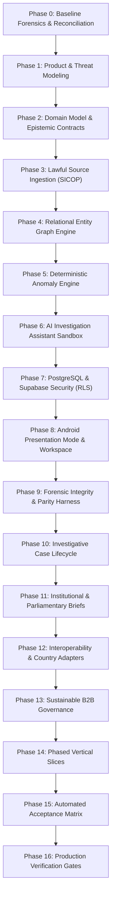

# Elysium Safety — Master Implementation Plan
## Citizen Security, Evidence Integrity, Territorial Intelligence & Anti-Corruption Framework

> **Operating Invariant (Charter & AGENTS.md):**  
> *"Todo en uno. Siempre a más, nunca a menos. Al máximo nivel de la humanidad."*  
> **Evidence ≠ Guilt · Claim ≠ Conviction · Anomaly ≠ Crime · A report is not proof · Visible personal wealth alone is never evidence of illegality.**

---

## 1. Executive Strategy & Dual-Track Separation

Elysium Safety addresses two complementary domains:

1. **Track 1: Citizen Security & Territorial Evidence (Institutional Track for Deputies):**
   - Structured incident reporting, forensic media custody (`SAFETY-CUSTODY-V2`), timeline chronology, spatial intelligence, and institutional gateway with Costa Rican authorities (Fuerza Pública, OIJ, Ministerio Público, Poder Judicial).
   - Dedicated **Institutional Presentation Mode** in Android for parliamentary demonstrations, presenting only security and evidence workflows without exposing automotive/mobility modules, while preserving 100% of the underlying codebase.
2. **Track 2: Public-Interest Financial Intelligence & Anomaly Engine (Investigative Track):**
   - Lawful ingestion of authentic public procurement (Costa Rica SICOP), corporate registries, official audits, and sanctions lists.
   - Explainable deterministic signals, graph relations, strict entity resolution without weak merges, and mathematical safeguards against personal wealth bias.

---

## 2. 16-Phase Master Engineering Directive

### Phase 0: Baseline Forensics & Reconciliation
- Pin repository state to exact HEAD SHA `f1eb6de4...` / `6ef0fef5...`.
- Reconcile status artifacts (`ELYSIUM_SAFETY_STATUS.json` vs `PRODUCTION-ATTESTATION.md`).
- Document real call sites for `ScientificEntity`, `CustodyProtocolV2`, and `AssertionStateMachine`.
- *Status:* **COMPLETED** (Recorded in `BASELINE_AUDIT.md`).

### Phase 1: Product Scope & Threat Model
- Delineate boundaries: public-interest investigation vs civilian surveillance.
- Forbid neighbor dossiers, residential pinpoints, and wealth-based criminalization.
- Implement defense in depth against hostile document prompt injection and Sybil report networks.
- *Status:* **COMPLETED** (Recorded in `THREAT_MODEL.md`).

### Phase 2: Domain Model & Epistemic Contract
- Unify truth states: `OBSERVED`, `AUTHORITATIVE`, `DERIVED`, `ESTIMATED`, `SIMULATED`, `UNKNOWN`.
- Formulate entities: `InvestigativeCase`, `SourceRecord`, `EconomicEntity`, `EntityRelationship`, `FinancialObservation`, `InvestigativeSignal`, `EvidenceReference`, `ReviewDecision`.
- Map directly to existing Room schema 90 and PostgreSQL migrations.
- *Status:* **COMPLETED** (Recorded in `DOMAIN_MODEL.md`).

### Phase 3: Evidence Ingestion & Lawful Adapters
- Interface boundary declaring legal provenance, rate limits, and error classification.
- Byte-exact SHA-256 computation of original incoming payloads.
- Reference adapter for Costa Rica SICOP (*Ley N.° 9986*).
- *Status:* **SPECIFIED & IMPLEMENTED** (Recorded in `SOURCE_ADAPTER_CONTRACT.md` and `SicopProcurementSourceAdapter.kt`).

### Phase 4: Graph & Cross-Reference Engine
- Relational PostgreSQL schema with indexed B-Trees and recursive CTEs (ADR-001).
- Conservative entity resolution: require matching Tax ID / Cédula Jurídica; forbid merging solely on name similarity.
- Explainable provenance for every edge in the graph.

### Phase 5: Explainable Deterministic Anomaly Engine
- Deterministic rules before machine learning (ADR-004).
- Rule 1: `ProcurementConcentrationRule` (uncompetitive award concentration).
- Mandatory inclusion of legitimate alternative hypotheses (emergency decrees, sole supplier).
- Mandatory missing data handling (`INSUFFICIENT_DATA`).
- Rejection of visible wealth observations (`FinancialObservationReviewPolicy`).

### Phase 6: AI Investigation Assistant Boundaries
- AI acts solely as an analyst assistant (ADR-002).
- Permitted: summarization, timeline drafting, finding contradictions.
- Prohibited: promoting epistemic states, altering evidence, assigning criminal scores, or executing tools from untrusted text.

### Phase 7: PostgreSQL and Supabase Security
- Multi-tenant isolation with server-enforced Row-Level Security (RLS).
- Zero client-side role authority; identity bound to Supabase auth claims.
- Private evidence storage with short-lived signed URLs.
- Append-only immutability triggers for evidentiary records.

### Phase 8: Android Integration & Institutional Presentation
- Dedicated Android Presentation Mode (`PresentationMode.INSTITUTIONAL_DEPUTIES`).
- Renders Citizen Reporting, Evidence Custody, Investigative Timeline, and Territorial Map without displaying mechanics or rides.
- Preserves 100% of the entire codebase and modules.

### Phase 9: Forensic Integrity & Parity Harness
- Protocol `SAFETY-CUSTODY-V2`.
- Byte-exact canonical JSON serialization.
- Cross-runtime parity verified across TypeScript and Kotlin (`tests/parity/ci-verify.sh`).
- Ed25519 digital signatures and Merkle inclusion proofs.

### Phase 10: Investigative Lifecycle & Governance
- Life stages: `DRAFT` $\to$ `SUBMITTED` $\to$ `SOURCE_VALIDATION` $\to$ `CORROBORATION` $\to$ `ANALYST_REVIEW` $\to$ `EDITORIAL_REVIEW` $\to$ `DISCLOSURE_APPROVED` $\to$ `CLOSED_OR_CORRECTED`.
- Contestability: named entities may attach contradictory evidence; no silent deletions.

### Phase 11: Institutional & Parliamentary Briefs
- Structured brief for the Deputies of Costa Rica (`INSTITUTIONAL_BRIEF_ES.md`).
- Clear classification: DEMONSTRATED NOW vs REQUIRES PILOT vs FUTURE EXTENSION.
- Formal meeting opening statement.

### Phase 12: Globalization & Interoperability
- Country-specific data adapters (Costa Rica SICOP, Registro Nacional, CGR).
- Normalization of currencies (ISO-4217 integer minor units) and dates.

### Phase 13: Sustainable Commercialization & Ethics
- B2B model: newsroom workspaces, auditor/compliance seats, procurement risk monitoring.
- Zero monetization of whistleblower identities, private dossiers, or paid suppression.

### Phase 14: Vertical Slices & Execution Order
- **Slice A:** Baseline audit, threat model, domain contracts, ADRs.
- **Slice B:** Policy contracts & wealth-only negative gate (`FinancialObservationReviewPolicy`).
- **Slice C:** Costa Rica SICOP Source Adapter with canonical hashing.
- **Slice D:** Procurement concentration anomaly rule with alternative explanations.
- **Slice E:** Android institutional presentation navigation mode.
- **Slice F:** Full automated verification & parity execution.

### Phase 15: Required Acceptance Matrix
- Test 1: Wealth-only observation produces `INSUFFICIENT_EVIDENCE`.
- Test 2: Unverified/unauthorized sources rejected.
- Test 3: Multiple copies of single source do not count as independent corroboration.
- Test 4: Similar entity names without matching tax ID are not merged.
- Test 5: Hash mismatch is detected; matching hash does not prove factual truth.
- Test 6: Offline report does not synthesize remote server receipt.
- Test 7: Institutional presentation mode filters out automotive/mobility routes.

### Phase 16: Production Verification Gates
- No item marked PASS without physically reproducible execution command.
- Verified test reports archived with SHA commit bindings.

---

## 3. Companion Deliverables Registry

| Document | Purpose |
|---|---|
| `docs/safety/global-financial-intelligence/BASELINE_AUDIT.md` | Audit of exact HEAD, test evidence, and status reconciliation |
| `docs/safety/global-financial-intelligence/THREAT_MODEL.md` | Privacy perimeter, adversary analysis, whistleblower safety |
| `docs/safety/global-financial-intelligence/DOMAIN_MODEL.md` | Formal entity specifications and epistemic state contracts |
| `docs/safety/global-financial-intelligence/SOURCE_ADAPTER_CONTRACT.md` | Lawful public records ingestion and SICOP schema |
| `docs/safety/global-financial-intelligence/DATA_PROTECTION_AND_DISCLOSURE.md` | Data classification, two-person rule, metadata stripping |
| `docs/safety/global-financial-intelligence/ARCHITECTURE_DECISIONS.md` | ADR-001 through ADR-005 technical rationales |
| `docs/safety/global-financial-intelligence/INSTITUTIONAL_BRIEF_ES.md` | Complete Spanish brief for the Legislative Assembly of Costa Rica |
